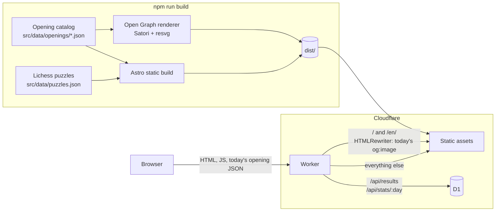

# Chessbitz

**A daily chess-opening challenge.** Every day there is a new opening to *play* on the board: find each move of the line, use hints if you get stuck, keep your streak alive and share a spoiler-free result — then study the line move by move and solve a real tactic from that opening.

[chessbitz.com](https://chessbitz.com) · [English](https://chessbitz.com/en/) · [Español](https://chessbitz.com/)


## Features

- **Playable daily challenge** — you play the side that defines the opening (black in the Sicilian, white in the Ruy Lopez); the opponent replies on its own. Drag-and-drop or tap-to-move, legal-move hints on the board, difficulty and move count shown up front.
- **Wordle-style scoring** — 5 mistakes per line and three hint levels (which piece → from where → the arrow). Every move ends up 🟩 first try, 🟨 with help or 🟥 revealed, and the grid can be shared without spoilers.
- **Your game vs. everyone's** — the result card compares your mistakes, hints and playing time with today's averages and highlights your column in the global distribution. Lifetime stats (streaks, mistakes per challenge, a 28-day calendar) live in their own panel.
- **366 curated openings** — one per day for a full year, each with bilingual names, a description, the strategic ideas behind it and an explanation for *every* move.
- **Tactic of the opening** — three puzzles per opening from the [Lichess open database](https://database.lichess.org/#puzzles) (CC0), matched to each line *by position*, unlocked after the challenge.
- **Archive and expert mode** — replay any past day (search, filters, random pick) in normal mode or in a Chessle-inspired expert mode: play the whole line blind, submit, get a colour per move, six attempts. Off-book replies come from a tiny built-in alpha-beta engine.
- **No accounts** — progress lives in the browser and moves between devices with an export file or code. Installable PWA that keeps today's (and tomorrow's) opening available offline.
- **Anonymous global stats** served from the edge, **rich link previews** with today's opening, Spanish and English, light/dark/system themes, a high-contrast colour-blind palette and a decorative 3D brass king on large screens.

| | | |
| --- | --- | --- |
|  |  |  |
|  |  |  |

## Architecture



- **Static first.** Astro renders the pages; the game is a React island. The client downloads only *today's* opening (`/data/daily/{n}.json`, ~2 KB) — the request starts in `<head>`, before hydration.
- **Pure game logic.** Everything that matters is framework-free and unit-tested: the challenge is a reducer (`src/lib/challenge.ts`), expert mode grades attempts (`expert.ts`) with a small alpha-beta engine for off-book replies (`engine.ts`), plus puzzles, the daily rotation, stats, progress import/export and share text.
- **Edge API.** A Cloudflare Worker serves the assets and a tiny API backed by D1. It stores only aggregated counters per `(day, mistakes)` — plays plus the sums of hints and seconds, for the averages — no cookies, no identifiers; the IP is used transiently for rate limiting and never stored.
- **Puzzles matched by position.** `scripts/puzzles.mjs` streams the 6-million-row Lichess puzzle CSV, maps every line of the catalog to Lichess's opening tags by replaying it against the Lichess opening list (names differ, positions don't) and keeps the three most popular puzzles per opening.
- **Link previews without SSR.** Crawlers don't run JavaScript, so the Worker rewrites the home page's Open Graph tags on the fly to point at a pre-rendered image of today's opening.


## Tech stack

Astro 5 · React 19 · TypeScript · Tailwind CSS 4 · chess.js · react-chessboard · Three.js (React Three Fiber) · Cloudflare Workers + D1 · Satori + resvg · Vitest · Playwright

## Quality

| | |
| --- | --- |
| Unit tests | 437 Vitest tests — challenge and expert engines, the reply engine, puzzles (every stored solution is legal), dates across time zones and DST, stats, progress import/export, API validation and every opening in the catalog |
| End-to-end | Playwright on desktop Chrome (drag and drop) and a mobile device (tap to move): daily challenge, hints and stats, tactics, archive, expert mode, settings and the guide |
| Lighthouse | Mobile **99 / 100 / 100 / 100**, desktop **100 / 100 / 100 / 100** (performance / accessibility / best practices / SEO) |
| Accessibility | Keyboard navigation, named board pieces for screen readers, live regions for feedback, `prefers-reduced-motion`, AA contrast in both themes |
| Privacy | Self-hosted fonts, locally generated 3D lighting, no third-party requests or cookies |

## Design decisions

- **Why a challenge instead of a viewer?** Recalling a move teaches far more than clicking "next". Limited mistakes and hints keep it fun for beginners without making it trivial.
- **Why curate 366 openings by hand?** The first version shipped 1,000 lines with template text ("A solid move.") that any chess player would notice. Fewer, correct lines beat volume. The content is validated by `scripts/check-openings.mjs` and the test suite, and the schedule only ever grows, so no player's history breaks.
- **Why the tactics and the archive, and not more daily puzzles?** One shared daily challenge keeps results comparable and shareable; everything extra (replays, expert mode, tactics) is counted apart, so it never distorts the streak or today's global stats.
- **Why no accounts?** The whole point is a one-minute daily ritual. An export code covers "I switched phones" without passwords or personal data.
- **Why the 3D king loads last.** Three.js is ~280 KB gzipped; it loads on the first interaction or after a few idle seconds, only on large screens, and pauses with reduced motion.
- **Why Cloudflare Workers + D1.** Static assets are free, the database sits next to the code, and the same Worker powers the API and the link previews.

## Project structure

```text
src/
  components/    React islands (challenge, study, result, board) and Astro layout pieces
  data/          Opening catalog (one JSON per family) and the daily schedule
  i18n/          UI strings (es, en)
  lib/           Framework-free logic: challenge engine, daily rotation, progress, stats API
  pages/         Home, archive, how-to-play and legal pages (es + en), 404, manifests and the JSON endpoints
worker/          Cloudflare Worker: API, D1 queries and link-preview rewriting
migrations/      D1 schema
scripts/         Content checks, schedule, Lichess puzzle picker, Open Graph renderer, README screenshots
tests/ · e2e/    Vitest and Playwright suites
```

## Development

```bash
npm install
npm run dev          # http://localhost:4321 (global stats are hidden without the Worker)
npm test             # unit tests
npm run test:e2e     # end-to-end tests (builds and previews the site)
npm run check        # type-check the site and the Worker
npm run build        # static site + Open Graph images in dist/
npx wrangler dev     # Worker + assets + local D1 on http://localhost:8787
```

Adding or editing openings: see [`src/data/openings/README.md`](src/data/openings/README.md). Deployment: see [`DEPLOY.md`](DEPLOY.md).

## Credits

3D model: "chess king" by [Amresh08_x_y_z](https://skfb.ly/pqzuU), [CC BY 4.0](https://creativecommons.org/licenses/by/4.0/). Tactics from the [Lichess puzzle database](https://database.lichess.org/#puzzles), CC0. Chess pieces from react-chessboard. Built by [acarrascosa](https://acarrascosa.com).
